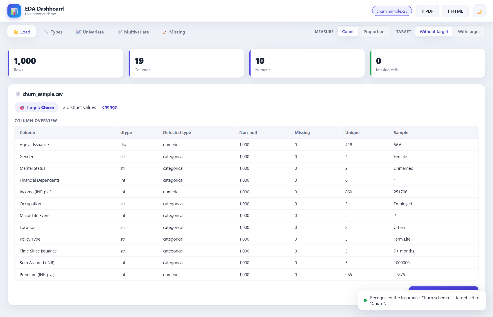
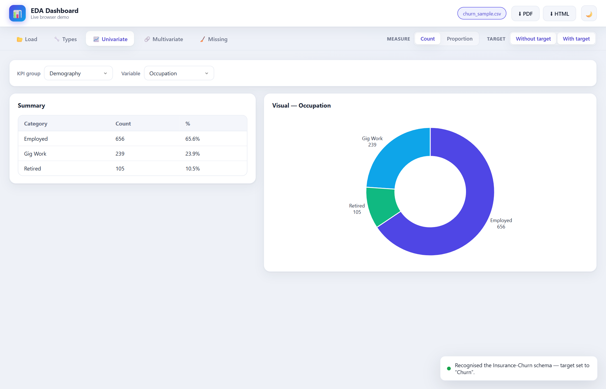
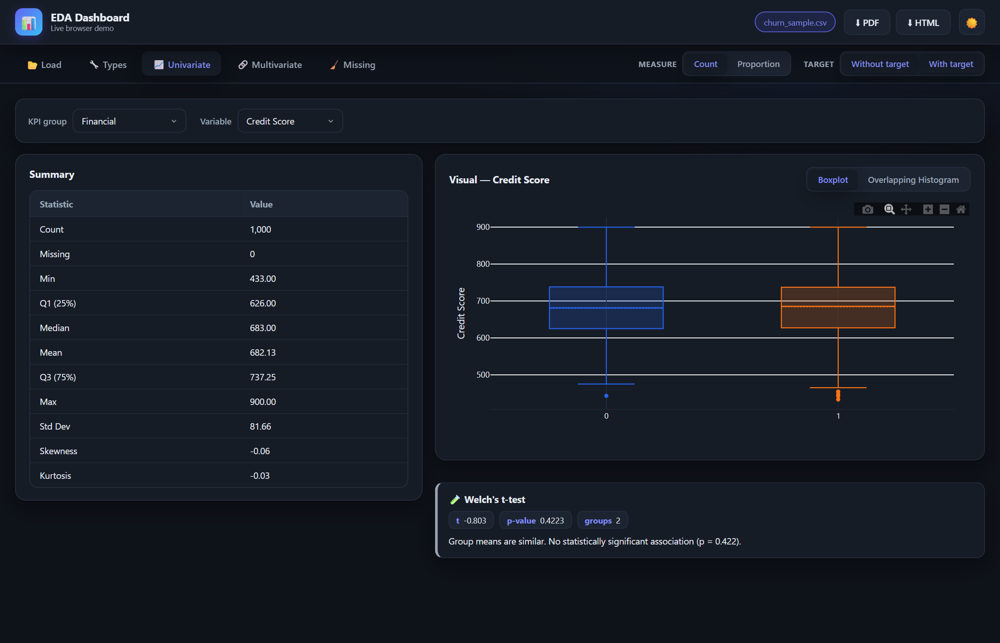

<div align="center">

<pre>
███████╗██████╗  █████╗ 
██╔════╝██╔══██╗██╔══██╗
█████╗  ██║  ██║███████║
██╔══╝  ██║  ██║██╔══██║
███████╗██████╔╝██║  ██║
╚══════╝╚═════╝ ╚═╝  ╚═╝
██████╗  █████╗ ███████╗██╗  ██╗██████╗  ██████╗  █████╗ ██████╗ ██████╗ 
██╔══██╗██╔══██╗██╔════╝██║  ██║██╔══██╗██╔═══██╗██╔══██╗██╔══██╗██╔══██╗
██║  ██║███████║███████╗███████║██████╔╝██║   ██║███████║██████╔╝██║  ██║
██║  ██║██╔══██║╚════██║██╔══██║██╔══██╗██║   ██║██╔══██║██╔══██╗██║  ██║
██████╔╝██║  ██║███████║██║  ██║██████╔╝╚██████╔╝██║  ██║██║  ██║██████╔╝
╚═════╝ ╚═╝  ╚═╝╚══════╝╚═╝  ╚═╝╚═════╝  ╚═════╝ ╚═╝  ╚═╝╚═╝  ╚═╝╚═════╝ 
</pre>

**EDA Dashboard**

<br/>

[](https://python.org)
[](https://pypi.org/project/PyQt6/)
[](https://pyodide.org)
[](https://plotly.com/javascript/)
[](LICENSE.txt)

[](https://pranava-ba.github.io/eda-dashboard/)
[](https://eda-dashboard.readthedocs.io/)

<br/>

*Load · Explore · Test — exploratory data analysis for any dataset, on your desktop or right in the browser.*

</div>

<br/>

---

## Installation

<details>
<summary><strong>🌐 Live Web Demo — nothing to install</strong></summary>
<br/>

Just open **[pranava-ba.github.io/eda-dashboard](https://pranava-ba.github.io/eda-dashboard/)**.
The whole app runs in your browser via [Pyodide](https://pyodide.org) (Python + pandas/scipy
compiled to WebAssembly). First load fetches ~20 MB, cached afterwards.

</details>

<details>
<summary><strong>🖥️ Windows — Standalone App</strong></summary>
<br/>

Build the executable (no Python needed to run the result):

```bash
python build_qt.py     # → dist/EDA_Dashboard/EDA_Dashboard.exe  (one-folder)
```

Distribute the whole `dist/EDA_Dashboard/` folder, or compile `installer_eda_qt.iss` in
[Inno Setup](https://jrsoftware.org/isdl.php) for a setup wizard.

</details>

<details>
<summary><strong>🐍 Run from Source</strong></summary>
<br/>

Requires Python 3.10+.

```bash
git clone https://github.com/pranava-ba/eda-dashboard.git
cd eda-dashboard
pip install -r requirements_qt.txt
python run_qt.py
```

</details>

---

## Quick Start

| Step | Action |
|------|--------|
| 1 | Open the app (or the [live demo](https://pranava-ba.github.io/eda-dashboard/)) |
| 2 | **Load** tab → **Browse files** or **Use sample data** (Excel / CSV) |
| 3 | **Types** tab → confirm the target column and each variable's numeric/categorical role |
| 4 | **Univariate** tab → pick a variable; toggle **With target** for split views + stat tests |
| 5 | **Multivariate** tab → choose 2–4 variables; scatter, heatmap, boxplots & tests auto-render |
| 6 | **Missing** tab to impute/drop gaps · **⬇ PDF / HTML** to export the current view |

---

## Screenshots

<div align="center">

<table>
  <tr>
    <td></td>
    <td></td>
  </tr>
  <tr>
    <td></td>
    <td></td>
  </tr>
  <tr>
    <td colspan="2" align="center"></td>
  </tr>
</table>

</div>

---

## Features

<details>
<summary><strong>📥 Load & Variable Types</strong></summary>
<br/>

- Reads Excel (`.xlsx/.xls`) and CSV/TSV
- **Churn-first but flexible** — auto-detects the insurance-churn schema and sets the target,
  or load any dataset and choose your own target + KPI groups
- Per-column overview (dtype, non-null, unique, sample) and numeric/categorical override

</details>

<details>
<summary><strong>📈 Univariate Analysis</strong></summary>
<br/>

- Numeric: summary statistics (quartiles, skew, kurtosis) + histogram with fitted normal curve
- Categorical: counts/proportions with auto pie / donut / bar by cardinality
- **With target** splits every view by the target (boxplots, overlapping histograms, grouped bars)

</details>

<details>
<summary><strong>🔗 Multivariate Analysis</strong></summary>
<br/>

- Pick 2–4 variables; every relevant pairing renders automatically:
  scatter + regression, correlation heatmap, grouped boxplots, cross-tab bars
- Optional colour-by-target overlays and grouped/stacked styles

</details>

<details>
<summary><strong>🧪 Statistical Tests</strong></summary>
<br/>

Each analysis carries a plain-language significance callout.

| Relationship | Test | Reported |
|--------------|------|----------|
| Numeric × Numeric | Pearson & Spearman correlation | r, ρ, p-value, n |
| Numeric × Categorical | Welch's t-test / one-way ANOVA | t or F, p-value |
| Categorical × Categorical | Chi-square of independence | χ², dof, p, Cramér's V |

</details>

<details>
<summary><strong>🧹 Missing Data & Export</strong></summary>
<br/>

- Missing-value overview per column, with drop-rows / drop-columns / mean / median / mode / zero
- One-click export of the current view to **PDF** or **HTML**
- Light / dark theme, responsive layout

</details>

---

## How It's Built

All analysis logic lives in a **single framework-free engine** (`app/core.py` +
`analytics.py` + `viz.py`, pure pandas/scipy). Two front-ends drive that same engine over a
pluggable bridge:

- **Desktop** — PyQt6 + `QWebEngineView`, Python↔JS via `QWebChannel`, packaged to an `.exe`.
- **Web** — the *exact same* Python runs in the browser via Pyodide; the bridge is a JS shim.

The UI (`frontend/`) is shared by both. See the [documentation](https://eda-dashboard.readthedocs.io/)
for the architecture in depth.

---

## Documentation

Full docs — installation, usage, features, architecture, and building/packaging — are at
**[eda-dashboard.readthedocs.io](https://eda-dashboard.readthedocs.io/)** (source in [`documentation/`](documentation/)).

---

<div align="center">

**BI Analytics** · © 2025–2026

</div>
