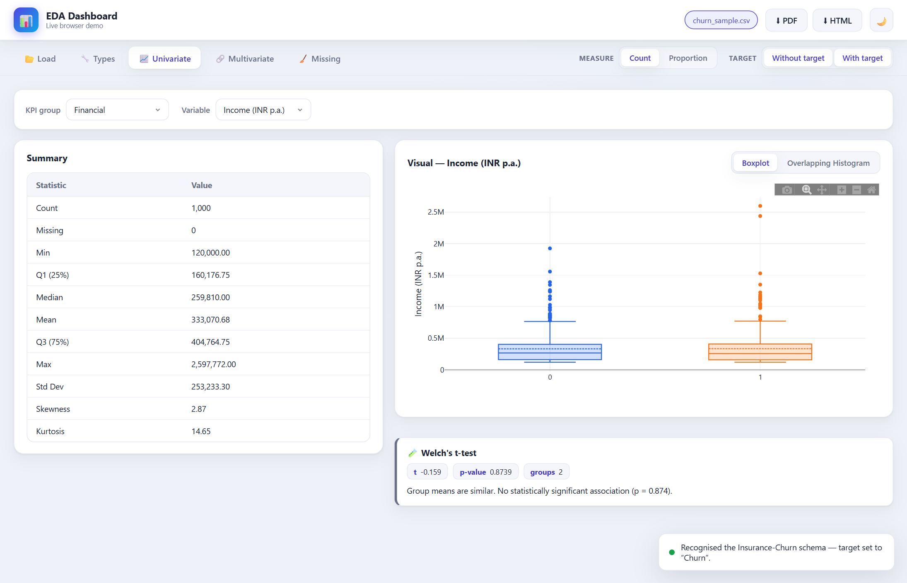

# EDA Dashboard

**EDA Dashboard** is a point-and-click tool for understanding a spreadsheet of data. You give
it an Excel or CSV file; it gives you tables, charts, and plain-language statistics that reveal
what's *in* the data and how the columns relate to one another — no coding required.

It comes bundled with an example about **customer churn** (whether insurance customers leave),
but it works with **any** tabular dataset.

```{admonition} Try it right now — nothing to install
:class: tip
Open the live demo: **<https://pranava-ba.github.io/eda-dashboard/>** and click
**Use sample data**. It runs entirely inside your browser.
```



## New here? Start with the ideas, not the buttons

If words like *variable*, *distribution*, *churn*, or *p-value* are unfamiliar, that's fine —
this documentation explains every one of them from scratch. Read the pages in order:

1. **{doc}`concepts`** — what data analysis is, in everyday language.
2. **{doc}`installation`** — get the app (or just use the browser demo).
3. **{doc}`quickstart`** — your first analysis, step by step.
4. The **User Guide** — a deep dive into each screen, what every chart means, and how to read it.

## What you can do with it

:::{card} Describe one column at a time
See the average, spread, and shape of a number column, or the category breakdown of a text
column. → {doc}`guide/univariate`
:::

:::{card} Compare two or more columns
Find out whether two things move together (e.g. income and credit score), or whether groups
differ (e.g. do people who leave have lower balances?). → {doc}`guide/multivariate`
:::

:::{card} Get real statistics, explained
Every comparison comes with a proper statistical test and a sentence telling you what it means.
→ {doc}`guide/statistical-tests`
:::

```{toctree}
:maxdepth: 2
:caption: Getting Started
:hidden:

concepts
installation
quickstart
```

```{toctree}
:maxdepth: 2
:caption: User Guide
:hidden:

guide/loading-data
guide/variable-types
guide/univariate
guide/multivariate
guide/statistical-tests
guide/missing-data
guide/exporting
```

```{toctree}
:maxdepth: 1
:caption: Reference
:hidden:

glossary
architecture
```
