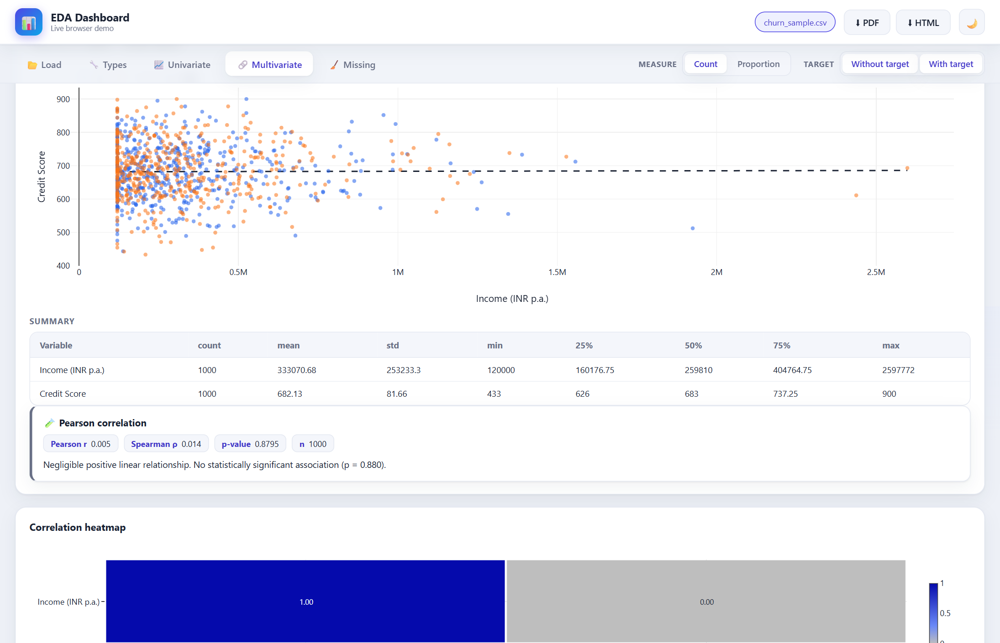

# Tutorial: Investigating Churn

This is a complete, worked analysis from start to finish. We'll use the bundled sample to answer
a real business question — **what makes insurance customers leave?** — and along the way you'll
see how to read every output and, crucially, how to tell a genuine finding from a coincidence.

Follow along in the app (desktop or the [live demo](https://pranava-ba.github.io/eda-dashboard/)).
It takes about 15 minutes.

```{admonition} What you'll learn
:class: tip
How to move through the whole workflow, read histograms/boxplots/scatter plots and statistics,
and — the part most tutorials skip — how to respond when the data says *"there's no strong
pattern here."*
```

## The question

We have 1,000 customers, and for each we know whether they **churned** (left) or stayed, plus 18
other facts about them (age, income, policy details… see the {doc}`reference/dataset`). Our job:
find which of those facts, if any, are associated with leaving.

## Step 1 — Load and orient

On the **Load** tab, click **Use sample data**. Read the summary cards:

- **1,000 rows**, **19 columns**, **0 missing** — a clean, complete dataset.
- The app recognises the schema and sets the target to **Churn**.


Skim the column overview table to get a feel for what you have — some columns are numbers (Income,
Credit Score), others are labels (Occupation, Policy Type).

## Step 2 — Confirm the variable types

On the **Types** tab, glance down the list. The important calls the app has made:

- Real quantities like **Income**, **Bank Balance**, **Credit Score** → **numeric**.
- Small-count columns like **Missed Payments** (0–5) and **Sum Assured** (5 tiers) → **categorical**.
- **Churn** is the target.

Leave the defaults for now and click **Apply**. (We'll revisit *Missed Payments* later.)

## Step 3 — Understand the pieces (univariate)

Before comparing anything, look at variables one at a time on the **Univariate** tab.

### How common is churn?

Pick the target itself. It's almost a coin-flip: **48.6% left, 51.4% stayed**. That balance matters
— it means "half of everyone churns", so any factor that *predicts* churn should push a group
noticeably away from 50%.

### The shape of a numeric variable

Choose **Financial → Bank Balance**. Read the summary:

| Statistic | Value | Reading |
|-----------|-------|---------|
| Median | ₹99,450 | half of customers have less than this |
| Mean | ₹140,099 | but the *average* is much higher… |
| Max | ₹1,533,599 | …because a few customers have huge balances |
| Skewness | 3.85 | strongly right-skewed |

This is a classic **right-skewed** distribution: the histogram piles up on the left with a long tail
to the right. The **mean sitting well above the median** is your tell — a handful of wealthy
customers drag the average up. (Compare with **Credit Score**, whose mean ≈ median ≈ 683 — a
roughly symmetric, bell-shaped variable.)

### A first look at a possible driver

Switch **Types** thinking for a second: intuitively, customers who **miss payments** might be more
likely to leave. Pick **Missed Payments** and turn on **With target** in the top bar. The grouped
bars hint at an upward drift — but hold that thought until Step 5, where we test it.

## Step 4 — Compare variables (multivariate)

Go to the **Multivariate** tab. Set **3 vars** and pick **Income**, **Credit Score**, and **Gender**,
then **Analyze**.

### A strong relationship — and a non-relationship

The scatter of **Income vs Credit Score** is a shapeless cloud, and the card reports **Pearson
r ≈ 0.00** — they're essentially **unrelated**. Now try swapping in **Sum Assured** and **Premium**:



Their scatter is a tight upward band, with **Pearson r ≈ 0.90** — a **very strong positive**
relationship. It makes sense: a bigger guaranteed payout (sum assured) costs a bigger premium. This
is what a real, strong correlation looks like, and the **correlation heatmap** makes it pop out in
red immediately.

### Every variable against churn

Turn on **With target** and re-analyze. The app now also compares each chosen variable to churn,
with a test for each. Work through a few — you'll notice the group differences are small and the
tests keep coming back **not significant**. That's not a mistake; it's the finding. Step 5 explains
why that's the right conclusion.

## Step 5 — What's real? (statistical tests)

Charts can tease you. The **test cards** keep you honest. Here's what a full sweep of this dataset
actually shows:

| Variable vs Churn | Test | p-value | Verdict |
|-------------------|------|---------|---------|
| Time Since Issuance | Chi-square | 0.029 | **weakly significant** (but Cramér's V ≈ 0.08 → tiny effect) |
| Missed Payments | Chi-square | 0.71 | not significant |
| Occupation | Chi-square | 0.51 | not significant |
| Income | t-test | 0.87 | not significant |
| Bank Balance | t-test | 0.93 | not significant |
| Credit Score | t-test | 0.42 | not significant |

Remember that upward drift in **Missed Payments** (churn rose from ~45% at 0 missed to ~59% at 4
missed)? The test says **p = 0.71 — not significant**. Why? Because only **17 customers** missed 4
payments; with so few, a swing to 59% is well within the range of chance. This is the single most
important lesson in the whole app:

```{admonition} A pattern in a chart is a hypothesis, not a conclusion
:class: important
The eye finds "trends" in random noise all the time — especially in small groups. Always confirm
with the test before believing a pattern, and check the **effect size** (Cramér's V, or how far a
group sits from the 48.6% baseline) to see whether it's big enough to matter.
```

## Step 6 — The conclusion

Our honest finding: **in this dataset, no variable strongly predicts churn.** The one
statistically-significant factor (Time Since Issuance) has an effect so small it's not practically
useful. Customers here leave at ~49% almost regardless of who they are.

Is that a failure? **No.** "There is no strong driver" is a real, valuable result — it tells a
business not to waste effort on a factor that doesn't move the needle, and to look elsewhere (or
collect different data). Learning to reach that conclusion *with evidence*, instead of inventing a
story from a coincidental-looking chart, is exactly what good exploratory analysis is for.

## Now try your own data

The workflow never changes:

1. **Load** your file and skim the overview.
2. Set **Types** and choose your **target**.
3. **Univariate:** understand each variable's shape.
4. **Multivariate + With target:** hunt for relationships.
5. **Read the test cards** — believe the ones that are significant *and* sizeable.
6. **Export** the views that tell the story ({doc}`guide/exporting`).

When you *do* have a real driver, it'll be obvious: a group sitting far from the baseline, a low
p-value, and a meaningful effect size all at once. Everything in the {doc}`guide/univariate`,
{doc}`guide/multivariate`, and {doc}`guide/statistical-tests` guides expands on the steps above.
